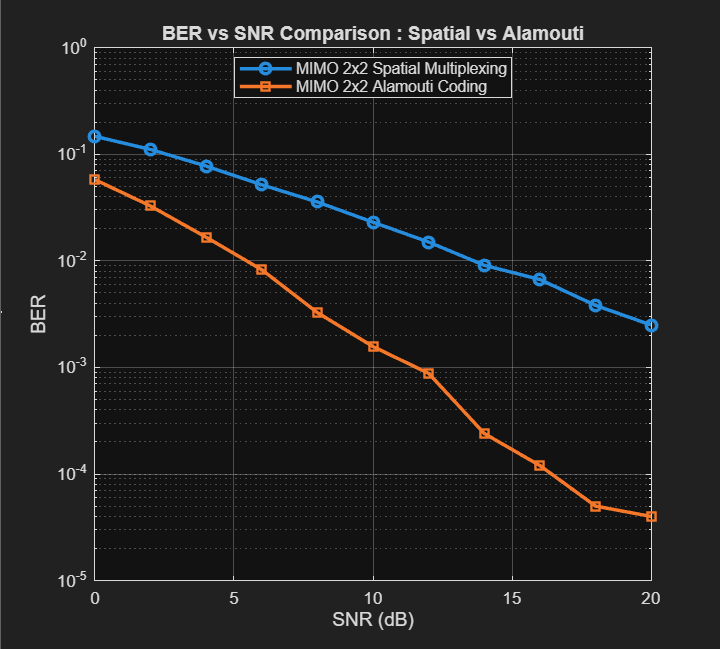

# 📡 MIMO 2x2 Simulation in MATLAB  

This repository contains MATLAB code for simulating a **2×2 MIMO (Multiple Input Multiple Output) system** under two schemes:  
- **Spatial Multiplexing (V-BLAST type)**  
- **Alamouti Space-Time Block Coding**  

The project demonstrates the trade-off between **capacity** (multiplexing) and **reliability** (diversity) in modern wireless systems.  

---

## 🚀 Project Overview  
- **Modulation:** BPSK  
- **Channel Model:** 2×2 Rayleigh fading  
- **Detection Methods:**  
  - Zero-Forcing (for Spatial Multiplexing)  
  - Alamouti Decoding (for Space-Time Block Code)  
- **Performance Metric:** Bit Error Rate (BER) vs. Signal-to-Noise Ratio (SNR)  

---

## 🛠 Workflow  
1. Generate random bit sequence.  
2. Map bits to **BPSK symbols**.  
3. Transmit over a **2×2 Rayleigh fading channel**.  
4. Apply detection/decoding:  
   - **Spatial Multiplexing:** Zero-Forcing Equalization.  
   - **Alamouti Coding:** Space-Time Block Decoding.  
5. Add AWGN noise.  
6. Compute **BER for each SNR value**.  
7. Plot **BER vs. SNR comparison**.  

---

## 📊 Results  

- **Observation:** Alamouti coding achieves **better BER performance** in low-to-medium SNR, while spatial multiplexing trades off reliability for **higher data rates**.  
- **Key Insight:** This reflects the real-world MIMO trade-off central to LTE/5G system design.  

  
*(BER vs SNR comparison: Spatial Multiplexing vs. Alamouti Coding)*  

---

## 📂 Repository Structure  

├── MIMO_simulation.m - MATLAB script (main code)

├── BER_vs_SNR_plot.png - Result plot (output figure)

└── README.md - Project documentation

---

## 📖 References  
- Alamouti, S. (1998). *A simple transmit diversity technique for wireless communications*. IEEE Journal on Selected Areas in Communications.  
- Wireless Communications (NPTEL) – CDMA, MIMO, OFDM Course.  

---

## 🔗 Connect  
If you found this useful or would like to collaborate on wireless communication projects, connect with me on [LinkedIn](www.linkedin.com/in/akshat-gupta-9b649a378).  
